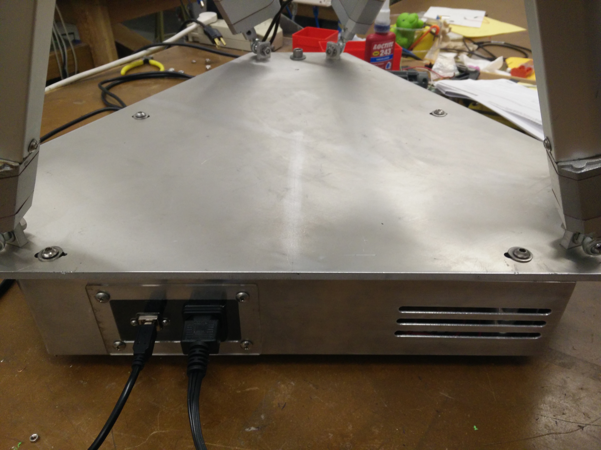
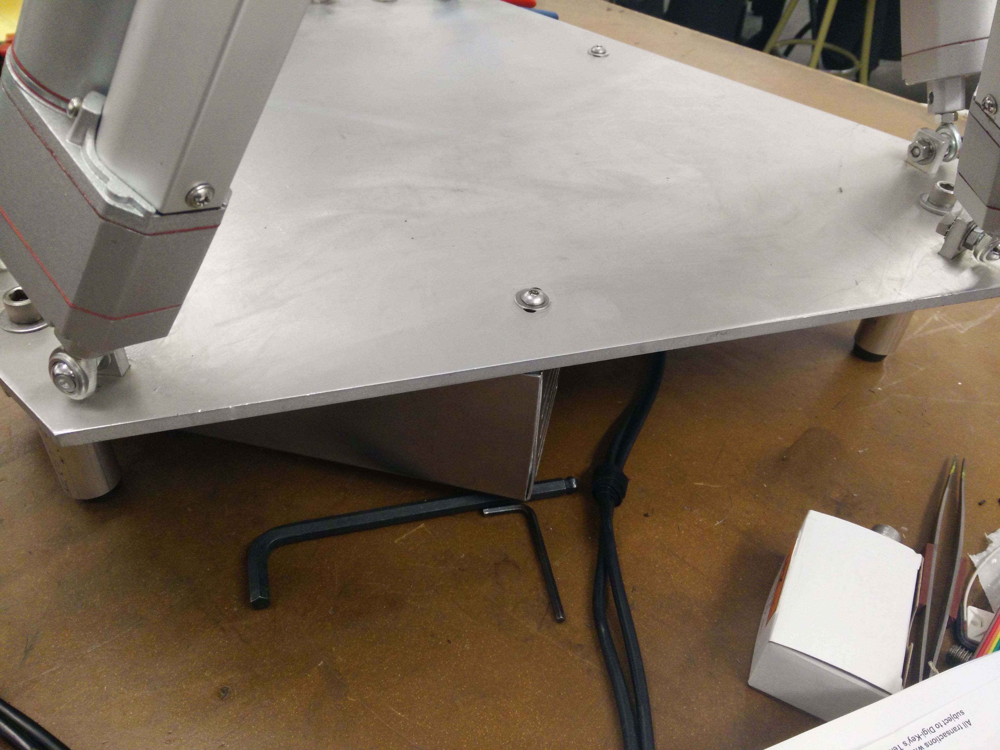
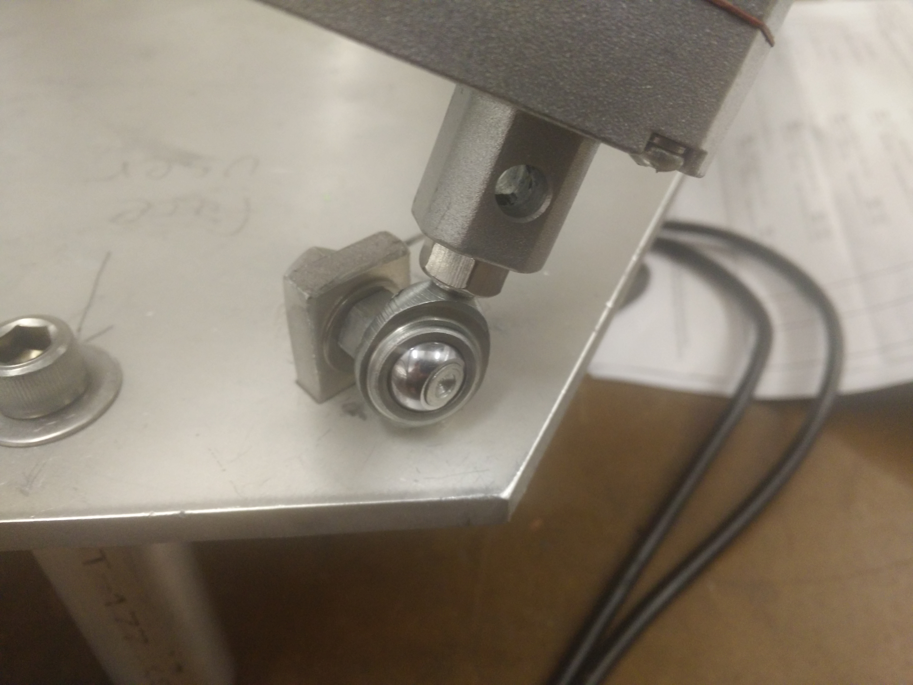
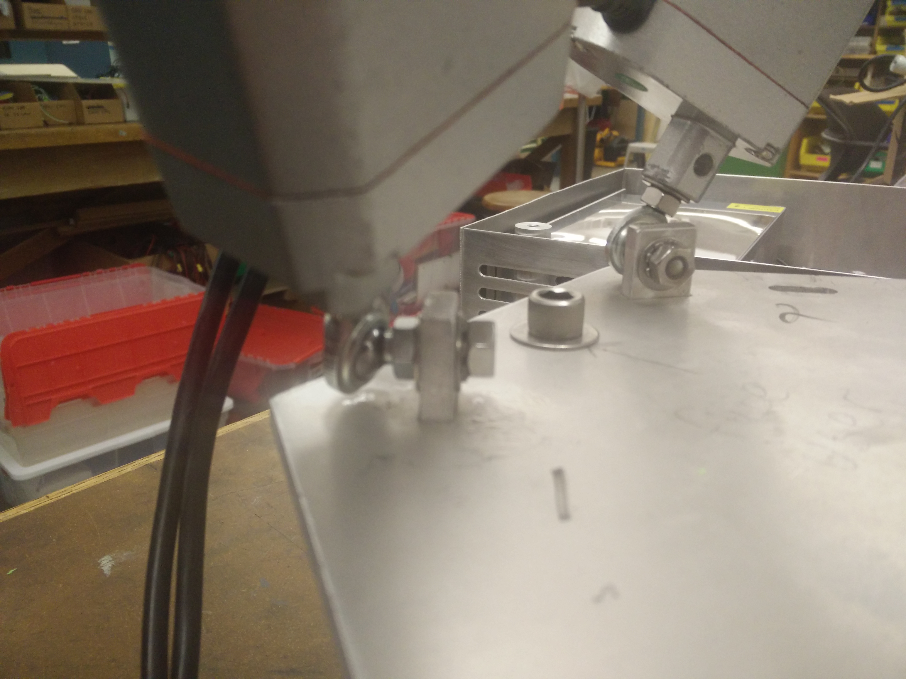
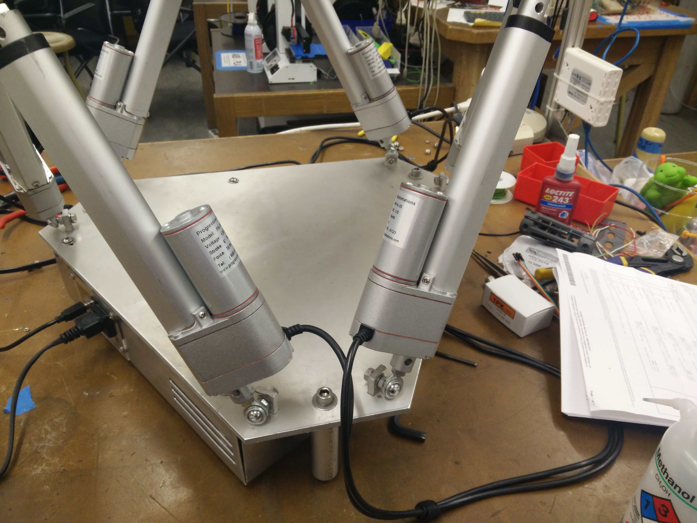
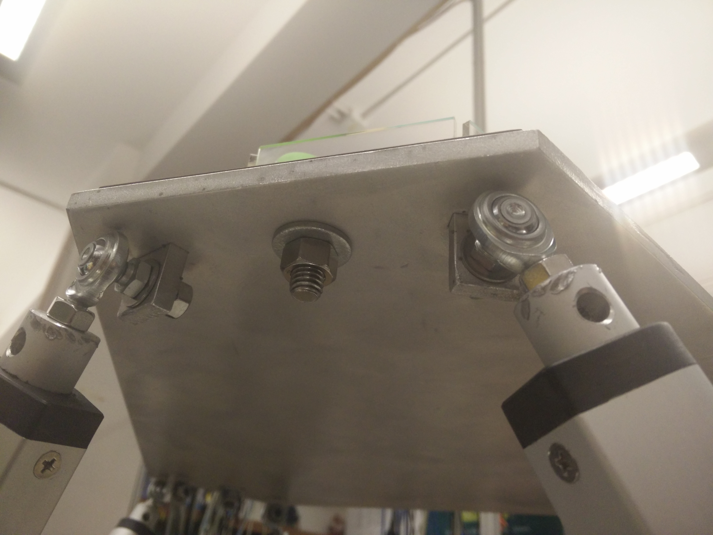
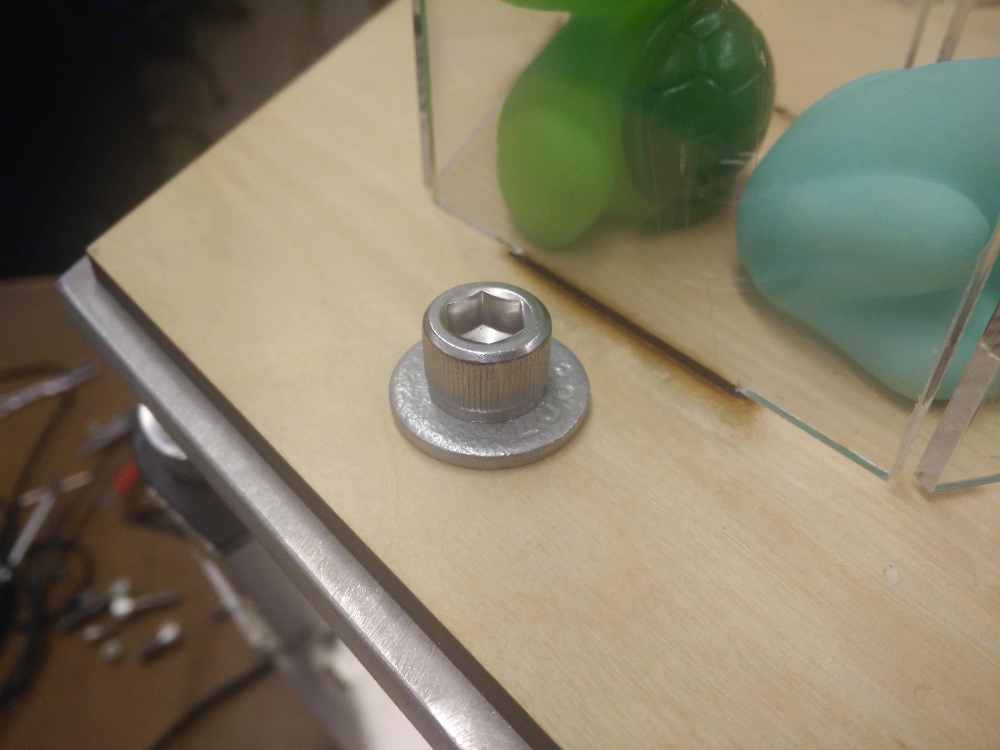
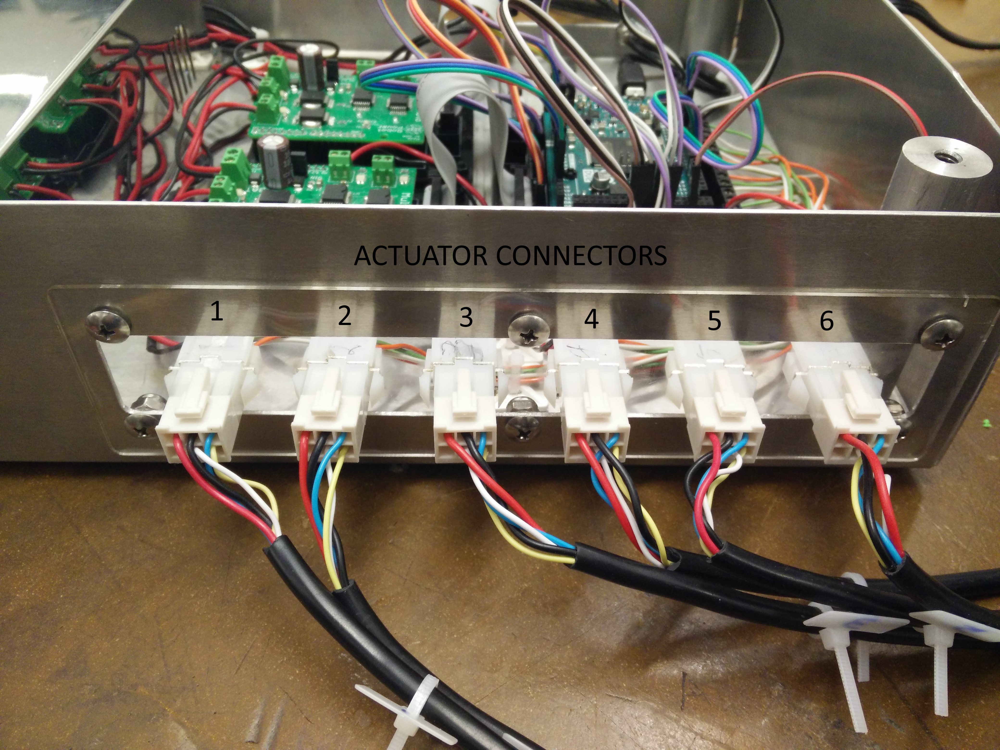

# Stewart Platform

# Quick Start Guide
1. Ensure that power to the platform is turned off, the USB cable from the platform is unplugged from the computer, and all GUI instances are closed.
2. (if Leap Motion is to be used) Ensure that the Leap Motion service and software is started, and the controller is plugged into the computer.
3. Turn on the power to the platform, and plug the USB cable from the platform into the computer.
4. Launch the GUI; in the 'Options' menu, click "Select COM Port".
5. Find the COM port corresponding to the Arduino Due (should show up in the Device Description on the left hand side, as shown), and change the baud rate to 115200.
6. Click connect, and the platform should immediately begin its calibration routine by moving all actuators to full extension, and retracting to minimum position. DO NOT SEND ANY COMMANDS TO THE PLATFORM DURING THIS PHASE!
7. Check the beginning of the log to ensure calibration has succeeded.
8. Manually control the actuators by moving the sliders and/or entering values into the corresponding textbox. To enable Leap Motion, ensure its status is "Connected", and tick the "Enable Leap Motion" checkbox above the sliders.

# Assembly Instructions

## Wiring the electronics

Before assembly, ensure that all the wires are adequately connected within the enclosure, including the power supply wires, the actuator power wires, the actuator signal wires, and the Arduino Due wires. Detail in [how the components are wired together](electronics/electronics_layout.pdf) and individual schematics are located in the `electronics` folder.

To ensure the code under `arduino/platform` is compatible with the wiring of the Arduino Due, the headers on the PCB should be connected to the respective pins in the table below. This assumes actuators 1 through 3 are connected to Multimoto 1 (to blocks M3, M2, and M1 respectively) and actuators 4 through 6 similarly to Multimoto 2. Note the actuator indexing for the PCBs differs from that in software.
- The indexing on the PCBs are ordered by the motor blocks on the Multimoto boards. Indices 1 through 4 correspond to M1 through M4 on Multimoto 1, and the same for indices 5 though 8 with Multimoto 2.
- The indexing in software is ordered by how the signal wires interface with the PCB terminal blocks. This should match the order (left to right) in which they are connected to the enclosure ports.

The UTIL pin headers (RESET, +3.3V, +5V, GND, GND, Vin) are connected to the identically-named Arduino pins and are omitted from this list. The exact pin numbering can be updated in software at `arduino/platform/pin_layout.h` if the wiring configuration needs to be modified.

| Header   | Pin |
|----------|----:|
| POT_1    |  A6 |
| POT_2    |  A7 |
| POT_3    |  A8 |
| POT_4    |  A9 |
| POT_5    | A10 |
| POT_6    | A11 |
| DIR_1    |  41 |
| DIR_2    |  39 |
| DIR_3    |  37 |
| DIR_5    |  35 |
| DIR_6    |  33 |
| DIR_7    |  31 |
| PWM_1    |  13 |
| PWM_2    |  12 |
| PWM_3    |  11 |
| PWM_5    |  10 |
| PWM_6    |   9 |
| PWM_7    |   8 |
| ENABLE_1 |  24 |
| ENABLE_2 |  25 |

[Pictures of wiring]

## Mechanical Assembly

Attach the 3 platform legs to the 3 corners of the base plate (Note: the base plate is larger than the top plate, and has 4 slots cut into it.), such that the 6 metal flanges are facing upwards. This is done using the ¾” long, ⅜”-16 threaded bolts, with one washer.

Next, position the enclosure underneath the base, so that the enclosure posts align with the slots in the base plate, with the power and USB connectors facing out as shown.

Attach the enclosure to the base place using 4 1” long,  ¼”-20 threaded bolts, with a washer for each. Ensure the bolts are aligned in the slots such that the corners of the enclosure do not extend beyond the edge of the base plates, like shown.

Attach the actuators as shown in the following picture. Close-up views of the joints are provided. Use 2 washers (one on each side), a lock-washer, and a ¼”-28 nut.

To avoid problems, ensure that the actuator gearboxes are facing upwards as shown in the picture.

Once the platform is assembled, attach the maze to the top plate by aligning the 3 corner holes on each, and secure it with 3 1¼” long, ⅜”-16 threaded bolts, with one washer on each, and a nut.

Connect all the actuator connectors to the appropriate receptacles on the enclosure, by routing the cables around and under the base plate. These can be bundled to be neat and out-of-view.

Finally, connect the power and USB cables to the front of the enclosure, and connect the other end of the USB cable. The platform is now assembled!

# Software Architecture

# Troubleshooting

Not working? Check all power connectors.

Arduino not seen by computer? Check cables.

Noisy actuator readings? Adjust the PWM feedback or the filtering capacitances on the Arduino PCB.

## Qt GUI build instructions
For Leap Motion control with Python: Python 2.7 x64 on Windows/MacOS (NB: for MacOS use version downloaded from python.org), with numpy and pyserial installed.

For GUI: Qt 5 (5.10.1 recommended), with serialport module in addition to the core libraries.

## PCB design
The PCBs were designed using [KiCAD v4.0.7](http://kicad-pcb.org/).

Each board has its design files under the `electronics` folder, along with Gerber files (under `electronics/gerber`) for the case of reproduction. The individual netlists can be found in the `.sch` files.
